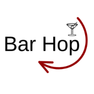

# Bar-Hop Team Project 

> Bar-Hop project. A web application with a cocktail-recipe search.
> Live demo [_here_](https://deromuald.github.io/bar-hop/). 

## Table of contents
* [General info](#general-info)
* [Technologies](#technologies)
* [Setup](#setup)
* [Instructions](#instructions)
* [Features](#features)
* [Screenshots](#screenshots)
* [Usage](#usage)
* [Project Status](#project-status)
* [Room for Improvement](#room-for-improvement)
* [Acknowledgements](#acknowledgements)
* [Contacts](#contacts)


## General Info
Current app will provide an ability to find a cocktail recipe by its name. As well, as ability to get a random cocktail by a click of a button.

## Technologies
Project is created with:
- HTML
- CSS
- JavaScript
- jQuery
- Google Map API and Places API
- TheCocktailDB Cocktail API


## Setup
To open this project in vscode using git in Terminal/Git Bash:

```
$ mkdir bar-hop
$ cd bar-hop
$ git clone https://github.com/DeRomuald/bar-hop.git
$ code .
```

## Instructions
<!-- left here remove it later -->
1. When you open app you presented with Age Check Modal and Location Access Allow window.
   - If you less than 21 and choose NO you will be redirected to a baby website. 
   - If you won't give permission to access your location if will use default location: Miami,FL. And display 20 close liquor stores to you
   - If you give permission to access your location the map will display close to your location
1. Enter a cocktail and click "Find a Recipe":
   - something
   - something


2. You can start a new search, just follow instruction in step 1.
- If you have previous searched a cocktail or three cocktails it will be displayed on the screen, new search will replace it.

3. If you want to .....
   
4. something.


## Features
- API
- DOM
- localStorage
- dynamically created elements

## Screenshots


## Usage
For information that helps you plan your outfit for day and week.

## Project Status
Project is: _completed_

## Room for Improvement
To do:
- something
- something


## Acknowledgements
- This project was inspired by UM Coding Boot Camp Project #1.
- This project was creating from scratch using ideas and believes of an incredible team of people👽.

## Contacts
Created by:
- [Stepan Matysik](https://github.com/elfsvet)
- [Rome Romulus](https://github.com/DeRomuald)
- [Marisol Matute](https://github.com/marisolxmatute10)
- [Juan Tantau (Luis)](https://github.com/JuanTantau)

